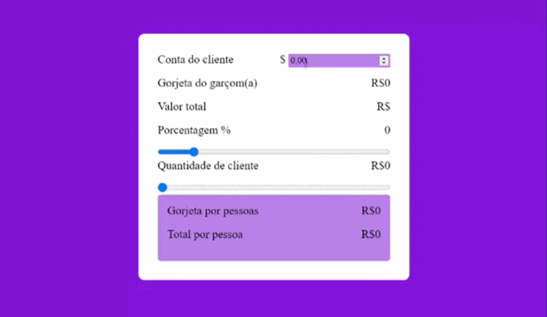

<h1 text="center"></h1>

# Calculadora de Gorjeta Javascript

Essa é uma aplicação de calculadora de gorjeta que permite aos garçons calcular a gorjeta que devem pagar com base no valor total da conta, a porcentagem de gorjeta desejada e o número de pessoas que dividirão a conta.

## As funcionalidades da aplicação incluem:

- Calcular o valor da gorjeta.
- Calcular o valor total.
- Calcular a gorjeta por pessoa.
- A aplicação tem uma interface intuitiva e fácil de usar que permite que os garçons ajustem facilmente a porcentagem de gorjeta e o número de pessoas que dividirão a conta.

## 👩🏽‍💻 Tecnologia Utilizada

O projeto foi desenvolvido com as seguintes tecnologias

- HTML

- CSS

- Javascript

# Visualize o projeto 

<h3>
     <a href="https://lyrisnunes.github.io/calculadora-gorjeta/">- Veja o projeto</a>
</h3>

---
Desenvolvido por Lyris Nunes